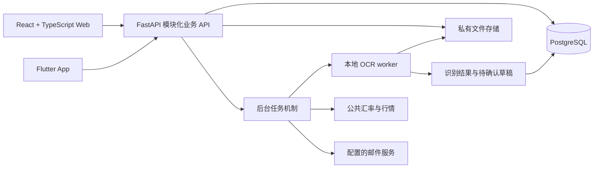

# Coinpup 架构概览

技术方向见 [ADR 0001](decisions/0001-modular-api-foundation.md)，产品边界见 [需求基线](../product/requirements.md)，任务状态见 [当前状态](../engineering/status.md)。

## 1. 工程基础

| 能力 | 职责 | 边界 |
| --- | --- | --- |
| `GET /api/v1/health/live` | 返回进程存活状态，不查询数据库。 | 不证明数据库、登录、账务或后台任务可用。 |
| `GET /api/v1/health/ready` | 使用 SQLAlchemy 对 PostgreSQL 执行 `SELECT 1`；数据库连接异常时返回 503。 | 不检查业务表、迁移版本、文件存储、OCR、邮件或完整业务流程。 |
| 环境配置 | `COINPUP_ENVIRONMENT`、`COINPUP_DATABASE_URL`、`COINPUP_DATABASE_CONNECT_TIMEOUT`，读取部署环境及本地未提交的 `.env`。 | 部署配置与公司业务资料分开，不承担多用户租户设置。 |
| 数据库连接 | SQLAlchemy engine 使用 `postgresql+psycopg`，带连接与语句超时、连接检查和退出释放。 | 结构管理、财务过账及更正使用事务。 |
| Alembic | 空基线建立迁移链起点，业务对象由后续迁移显式引入。 | 执行空基线不代表业务 schema 已就绪，不在应用启动时隐式建表。 |
| 健康接口输出 | 仅输出服务名及状态，连接错误不向响应暴露连接信息。生产模式关闭 API 文档入口。 | 隐藏文档入口不是身份认证或访问控制。 |
| 管理员与会话 | CLI 初始化/重置管理员，HTTP 登录/会话/退出，Origin 与 CSRF 校验。 | 业务接口统一接入相同访问边界。 |
| 网页与恢复 | 网页构建后同源提供；PostgreSQL 备份及数据库/原件一致 bundle 恢复。 | 备份演练不能替代生产部署和恢复核对；新增业务须纳入恢复范围。 |
| 独立账本结构 | 资产、主体、账本、账户、账户资产、分类；结构 API 使用版本与归档。 | 公司资料、证件原件、结构化证件字段和提醒分别建模。 |
| 财务过账与修订 | 业务操作、封存分录、幂等回执及更正/取消版本链。 | 经营单据和结算通过账务核心改变余额。 |
| 私有文件 | 原件元数据、上传预留/回执与流水证据；原件不可变，鉴权下载，标题和归档有版本。 | 文件查重不代表业务去重，上传不产生费用或自动入账。 |

源代码入口：[应用](../../services/api/src/coinpup_api/main.py)、[配置](../../services/api/src/coinpup_api/config.py)、[数据库连接](../../services/api/src/coinpup_api/database.py)、[空迁移基线](../../services/api/migrations/versions/20261003_0001_baseline.py)。

身份与会话的设计见 [ADR 0002](decisions/0002-administrator-session.md)，操作见[备份恢复说明](../engineering/operations.md)。

结构持久化和访问/版本约束见 [ADR 0004](decisions/0004-owned-ledger-structure.md)。归属约束由服务检查和数据库复合外键共同保证，备份验收随应用表扩展。

真实业务数据、私有附件及任何具有财务副作用的接口，必须在实现对应的鉴权、授权、事务和审计约束后接入。健康 API 保持有限语义；未来若增加 schema 或其他依赖检查，应同步修改文档和测试。

## 2. 目标技术形态

采用模块化单体：核心业务在一个 FastAPI 应用与 PostgreSQL 数据库中，以明确模块边界组织。耗时的本地 OCR 使用独立 worker 进程；它是同一系统的异步处理组件，不把每个业务模块拆成独立微服务。

| 部分 | 技术方向 |
| --- | --- |
| Web | React + TypeScript，支持中英文与手机布局，联网使用。 |
| API | FastAPI；业务契约统一供 Web 和 App 使用。 |
| 持久化 | PostgreSQL；SQLAlchemy 管理访问，Alembic 管理迁移。 |
| 文件 | 私有本地卷与不可变随机键，数据库保存文件元数据及业务关联。 |
| 本地识别 | 服务器内的文本提取／OCR worker，异步任务驱动。 |
| 定时工作 | Invoice 周期草稿、行情抓取、提醒、备份等后台作业。 |
| Android／iOS | Flutter，共用 API；本地数据库保存缓存和离线操作。 |

以下图表示目标模块关系，不表示部署拓扑或开放端口：

OCR 产出草稿和结构化候选数据；只有经过用户确认的业务命令才能形成入账记录。队列实现、worker 数据访问方式及资源配置按实际样本与运行约束选择。

## 3. 模块边界与归属

| 目标模块 | 负责内容 | 边界 |
| --- | --- | --- |
| 身份与工作空间 | 单用户身份、会话、访问检查、工作空间。 | 单用户不等于没有认证；不提前引入公共注册或协作审批。 |
| 主体资料 | 个人／公司、地区和公司类型、注册资料、自定义字段。 | 主体资料与资金账户分离；地区规则不能写死成一个通用税号字段。 |
| 账务核心 | 账本、账户、资产、分类、分录、期初余额、转账、冲销。 | 唯一的账户余额事实来源；其他模块通过业务命令改变账务。 |
| 经营业务 | 客户供应商、项目、业务单据、分类行、商业 Invoice。 | 单据说明业务事实，不能把单据金额和对应付款各累计一次费用。 |
| 结算与往来 | 收付款、单据分摊、预收预付、代付、报销、成对往来。 | 与账务核心在事务中保持一致；跨主体关系显式记录。 |
| 文件与票据 | 私有文件、识别任务、候选明细、重复提示、人工确认。 | worker 不绕过确认自动入账；上传文件与付款记录不是同一对象。 |
| 汇总与估值 | 主体集合、分类映射、统计视角、报价、内部交易处理。 | 计算视图，不在切换报表时改写历史交易。 |
| 提醒与规则 | 适用条件、规则来源、版本、日期、人工覆盖、渠道投递。 | 日期推算与是否适用分别表达，不猜测缺失的税务参数。 |
| 同步 | 稳定 ID、版本检查、增量读取、重试、删除传播及设备状态。 | 冲突保留双方修改，删除标记防止旧设备恢复已删除记录。 |

模块可以共享数据库事务，不各自维护一套影子余额。共享表、迁移、金额规则和 API 契约由集成负责人协调；前端、OCR、报表或提醒任务不能自行创造不兼容的付款模型。

## 4. 业务事实与账务一致性

### 4.1 主体、账本与账户

目标关系为 `Workspace → Entity → Ledger → Account → AssetBalance`。Entity 表示个人或公司；账户可以持有多种法币或加密资产。

- 每项账户、分类、单据、项目和附件关联明确归属，跨主体引用必须通过校验。
- 分类模板复制后独立；聚合分类映射是报表关系，不改变本地分类。
- 账户持有人与费用归属主体分别记录。不能通过把个人付款账户“临时放进公司账本”实现代付。
- 首版只有一个用户，仍需区分主体归属与访问所有者，避免将来通过全局默认主体丢失财务归属。

### 4.2 单据、付款与 Allocation

目标对象分为 `Document`、`DocumentLine`、`Payment/Transfer` 和 `Allocation`。

- DocumentLine 保存业务金额、分类、项目及归属期间；有效业务单据支持经营统计。
- Payment 记录真实收付款，Transfer 记录账户之间的资金移动。
- Allocation 表示某次付款结算哪些单据、每张单据结算多少，支持多对多及部分结算。
- Allocation 不额外改变一次账户余额。识别出的银行流水匹配已有 Payment 后只增加来源关联。
- 同一业务的经营费用取单据归属，实际资金流取付款；两者不能相加。
- 草稿不直接形成有效应收应付或收入费用；周期 Invoice 重试不重复生成同一周期草稿。
- 退款、撤销、修改与超额结算有显式状态和审计链，不通过删掉旧行掩盖差额。

例如 300 USD 账单分别支付 100、50 USD：费用为 300，已付为 150，未付为 150；不是 450 的费用。

### 4.3 代付与合并

个人账户支付 100 CNY 的公司费用时，公司记录费用及对个人的待偿还往来；个人记录实际资金流出和对应往来。公司偿还 100 时只结清往来，不再新增费用。

- 公司费用为 100，个人生活费用为 0，合并对外费用仍为 100。
- 实际账户现金流按付款账户统计；按费用归属的已付款统计必须使用不同的明确标签。
- 转账、借款、信用卡还款、报销偿还在单个账本里本来就不是经营收入／费用。
- 双方都在所选主体集合时，可以从合并资金流排除已关联内部转移；给外部商家的原始付款保留。
- 真正的内部销售／采购只对明确关联且双方均被选中的记录做对应合并处理，并遵循内部交易展示开关。
- 相同金额和日期不是自动抵销依据，未关联记录只能给出候选提示。

### 4.4 事务与审计

账务核心以复式分录或等价的可验证结构维护余额，前台保持收支操作。入账、付款分摊、往来配对、版本检查和重复请求保护必须具有一致的事务边界。

已入账修改使用可审计的冲销／替代或等价原子操作。数据库迁移遵循 Alembic 链，业务表通过迁移显式引入；不在应用启动时隐式建表或通过删库绕过迁移问题。

期初和手工收支的原子过账与持久回执见 [ADR 0005](decisions/0005-atomic-posting-and-receipts.md)；同资产转账和信用卡还款见 [ADR 0006](decisions/0006-same-asset-transfers.md)；实际换汇与手续费见 [ADR 0007](decisions/0007-exchanges-and-explicit-fees.md)；更正、取消与历史见 [ADR 0008](decisions/0008-operation-revisions-and-cancellation.md)。

换汇使用两种资产各自的实际数量，允许同账本同账户内换汇。分录的 `component_no=0` 保存本金，1–20 分别保存手续费；每部分独立逐资产配平，换汇对方行没有收入或费用分类。每项手续费明确扣款账户、资产和费用分类，可以由其他账户或第三种资产支付。服务验证全部引用及最终合计余额后，在同一事务提交本金、全部费用和回执；数据库继续保证归属、精度、配平与封存。

旧无费用请求的摘要字段集合已冻结，省略费用与空数组产生同一摘要；旧回执 JSON 不补写空 `fees`。带费用的收支/转账和换汇通过 `kind` 判别联合类型读取，保留本金与费用的各自数量。已有换汇或手续费历史时迁移降级明确拒绝，不能通过删除记录完成降级。

更正保留业务 ID，并以版本加一的方式原子追加完整反向凭证和替代入账。取消仅追加反向凭证，形成不可重新激活的 `cancelled` 状态；`current_journal_id` 仍指向最近正常入账，余额则求和全部账户行。反向凭证保持原日期、描述、资产、账户、分类与组成部分，并精确取反全部本金和费用。数据库验证连续版本链、唯一冲销、替代原因一致和最终指针；原凭证及行继续封存。

新修改要求当前 `expected_version`、原因与幂等键；命中旧回执先于版本和归档检查，因此历史命令可以安全重试。主体归档暂停任何新修改，旧账户或资产停用只影响替代内容的有效性，不阻止对旧引用冲销。GET/列表返回当前状态与 `latest_posting`，列表默认保留取消状态；旧创建 POST 和修订 POST 各自重放原始回执，不能把历史回执当作当前状态。历史执行人在单用户模式下来自业务所有者。

## 5. 金额、资产与报价契约

精确金额与资产身份见 [ADR 0003](decisions/0003-exact-asset-amounts.md)。

- 业务金额与资产数量使用 Decimal／数据库 NUMERIC 或等价精确表示；不经过二进制浮点数作为存储或计算中间值。
- API 用十进制字符串传输金额，例如 `{"amount":"123.45","asset":"USD"}`；ETH 数量可表达为 `"1.000000000000000001"`。前端不可先转为 JavaScript `Number` 再参与财务计算。
- 资产目录规定精度和必要的网络区分；不能把全部资产统一截成两位小数。余额按账户与资产维度分别保存或计算。
- 每个账本有记账基准币，同时保存原币／资产数量及实际结算信息。基准币与用户临时选择的展示币是不同概念。
- 换汇记录两端资产、转出数量、转入数量及手续费；实际成交比率可由两端数量推导，不另用舍入汇率覆盖数量。跨币种 Allocation 同时保留单据币种和付款币种的结算数量。
- 展示报价保存来源、有效时间、获取时间和所用币对；交易日历史报价与最新报价可切换，不能覆盖实际成交数量。
- 默认原币分别展示，统一展示币为 USD、GBP、EUR、HKD、CNY。汇总必须能回查原始记录及所用报价。
- 报价缺失时显示不可估值或部分估值，不用 0 填补。缓存行情显示时间；USDT／USDC 不固定等于 1 USD。

换一份报价只改变估值结果，不产生一次账务更新。需要入账的实际换汇差额与报表的行情变化分开设计，不引入未要求的加密资产交易盈亏模块。

## 6. 私有文件、本地识别与外部调用

文件原件存放在部署控制下的私有存储中；数据库保存所属主体、文件标识、类型、摘要、上传状态及业务关联。不能把注册证书或票据作为无需授权的静态 URL 暴露。

目标处理链为：上传完成并校验 → 识别任务 → 本地文本提取／OCR → 候选数据 → 用户核对及拆分 → 业务确认入账。

- PDF 文字提取及图片 OCR 均在自有服务器内完成；模型和处理资源用实际样本验证。
- 独立 worker 隔离长耗时任务，重试只更新任务或草稿状态，不自行重复记账。
- 需要限制文件处理资源并保持任务状态可追踪；失败和低置信度结果进入待处理状态。
- 原件、识别结果、文件哈希和业务关联各自保留；文件重复和业务重复是不同问题。
- 对外允许的已确认业务调用是公共汇率／行情与配置的邮件提醒。行情请求不附带账单、证件或交易明细，OCR 不调用外部识别服务。
- 附件与数据库关联一同纳入备份，恢复时验证内容及引用；不能只备份数据库中的路径。

私有文件使用本地不可变 blob 与 PostgreSQL 元数据、两步可重试上传以及共享快照的数据库/文件 bundle，见 [ADR 0012](decisions/0012-private-files-and-consistent-bundles.md)。上传格式签名校验不等于完整解析或 OCR 结果；网页原件管理与未知结果恢复见 [ADR 0013](decisions/0013-document-web-and-upload-recovery.md)。队列组件、OCR 模型和邮件库按实际样本与运行约束选择。

## 7. 提醒规则与后台幂等

规则数据应包含地区、公司类型、适用条件、所需参数、来源、核验时间和版本。运行时保存所用规则版本、推算日期、用户覆盖值及提醒状态。

- 已确认范围包括证件到期、年审和税务申报；具体规则实现前逐项核验官方来源。
- 州、财年、税务身份、上次续期等参数按适用规则收集；不能只按国家和成立日期假定全部义务。
- 缺参数或缺核验规则时显示待确认，可改用人工日期。
- 更新规则不能静默覆盖人工日期，应保留对比依据。
- 周期草稿生成与提醒投递使用各自稳定幂等键，失败重试不能变成重复业务或重复提醒。
- 日期归属、调度时区和提前天数显式记录，站内提醒与邮件投递状态分开。

## 8. 同步与离线 App 设计约束

跨接口通用约定见 [API 约定](api-conventions.md)，单个接口以 [OpenAPI](../../contracts/openapi.json) 为准。API 与同步设计遵守以下契约：

- 稳定记录 ID，兼容后续客户端离线生成标识；具体格式由契约决定。
- 主体与账本归属、服务端版本及明确的条件更新规则。
- 幂等键的作用域、结果保存与重放行为；同一财务命令的重试不能再记账。
- 修改顺序／增量游标以及删除标记（tombstone）或等价设计。
- 金额字符串、错误结构及附件引用等跨端表示。

Android／iOS App 通过共享 API 同步，本地行为遵守以下约束：

- 本地数据库保存已缓存历史与 outbox；离线支持新增、拍照、查看、编辑、删除。
- App 重启不丢失待同步操作；记录提交与附件上传有独立状态。
- 联网后上传附件并在服务器识别；手机离线 OCR 不在已确认范围内。
- 增量同步发现版本冲突时保留两份修改供解决，不能无提示地用最后上传覆盖。
- 删除标记向旧设备传播，防止已删除记录重新出现；标记保留与长时间离线的处理策略一起设计。
- 重复提交、连接中断和响应丢失按幂等契约处理。

Web 首版始终是联网应用。为 App 预留契约不要求默认缓存全部历史附件到手机。

实施顺序与依赖见 [路线图](../engineering/roadmap.md)，业务验收条件见 [业务验收基线](../product/acceptance.md)。命令、结果和 CI 证据保存在对应 PR 中；健康检查成功不能替代业务验收。
